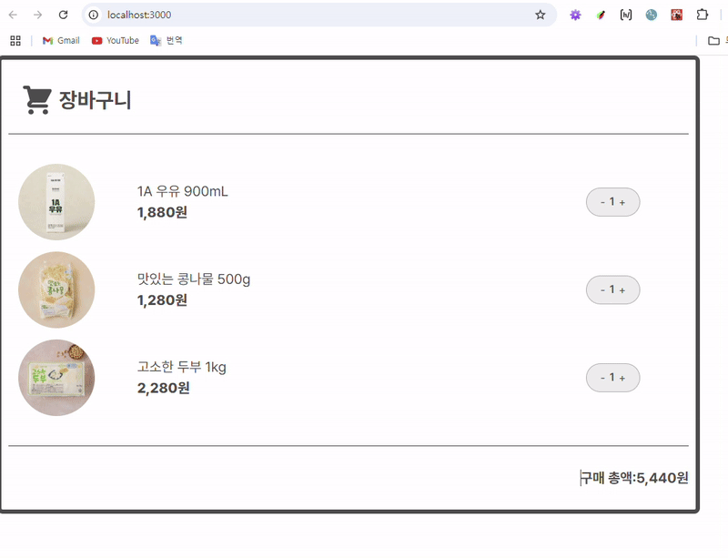

# 쇼핑 카트 UI 구현

### 컴포넌트 구성

1. cart-count-button

- sr-only, aria-label, aria-live, aria-disabled 속성을 통해 수량 증감 버튼 사용성 고려
- 최소 수량(1) 최대 수량(max)에 따른 버튼 비활성화
  

- useState를 통해 현재 수량 상태(count) 저장
  

- onUpdate 함수를 통해 count 상태 끌어올리기
  

2. cart-item

- aria-labelledby, sr-only 속성을 통해 상품 정보 제공
- `<dl>,<dt>,<dd>`를 통해 상품 정보 마크업
- toLocaleString()을 사용하여 가격 정보 기재
  

- onUpdate 함수를 통해 count 상태 전달
  

3. cart

- productList에 상품 데이터 저장
  

- useState를 사용해 초기 상품 수량(productCount, initialCount) 저장
  

- map()을 사용하여 상품 정보 렌더링
  

- onUpdate 상태 끌어올리기를 통해 count 상태 정보를 productCount 상품 수량에 업데이트
  
  

- reduce()를 사용해 상품 총액(totalPrice) 업데이트
  

---

### 결과

---

### 회고

1. 과제를 통해 배운 점  
   과제를 통해 `<dl>,<dt>,<dd>`, `aria-live`, `aria-labelledby` 의 사용에 대해서 잘 정리할 수 있었고 `aria-disabled`와 `disabled`의 차이에 대해서 다시 한 번 정리할 수 있었다. 또한, `onUpdate`를 통한 상태 끌어올리기의 흐름에 대해서 잘 파악할 수 있어 강의에서 어려웠던 부분을 보충할 수 있었다.

2. 느낀 점/어려운 점  
   cart.tsx 컴포넌트를 작성하면서 productCount의 초기 상태 저장을 하는 부분에서 어려움을 느꼈다. `useState()`에서 초기 상태를 함수를 통해 값을 return하여 저장하는 부분에 대해서 조금 더 학습이 필요다고 생각했다. 또한, 중간중간 코드를 작성하면서 typescript의 문법 오류때문에 어려움을 느껴 type 설정에 대해서 좀 더 훈련이 필요하다고 생각했다.

---
